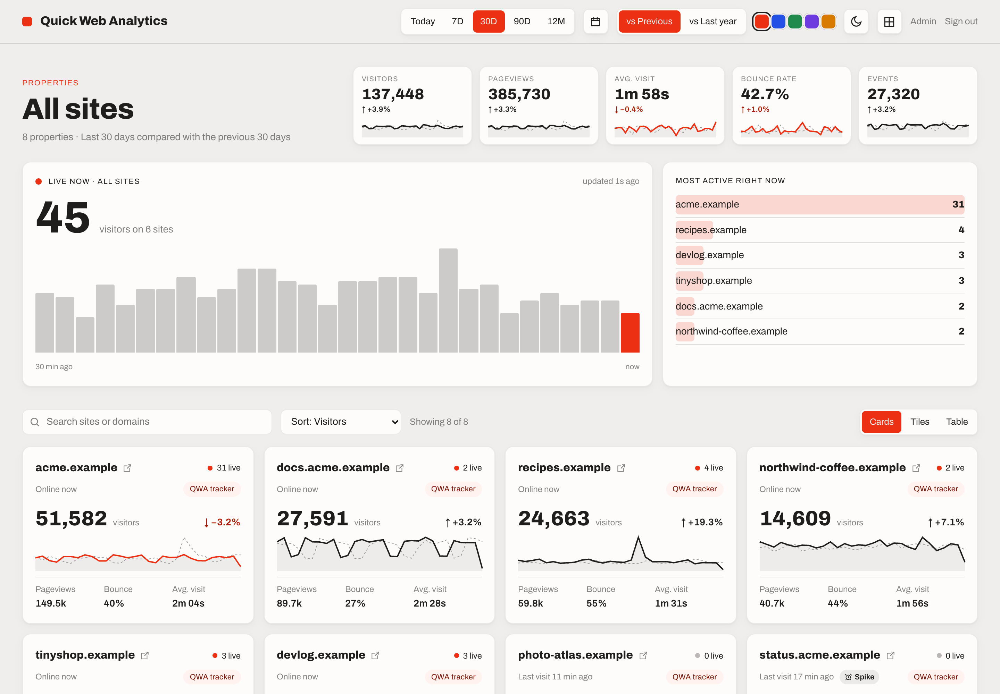
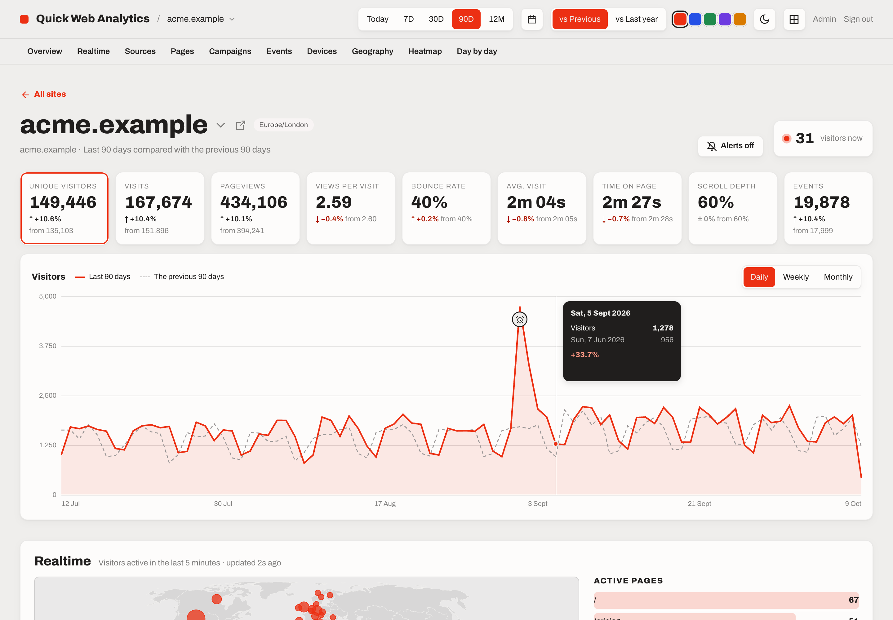
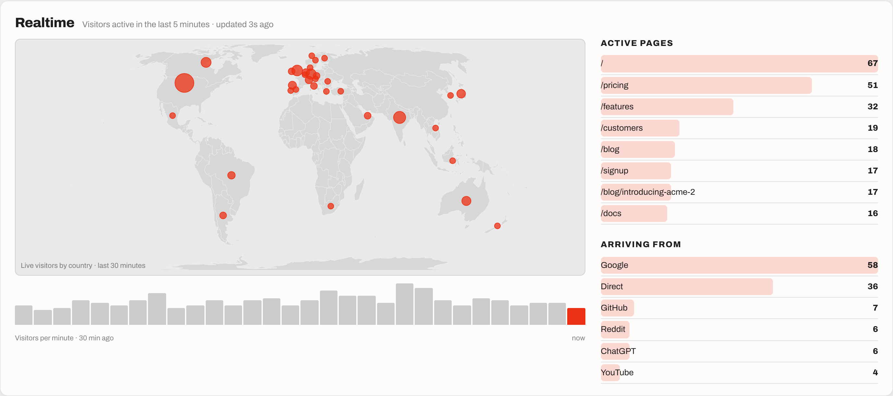
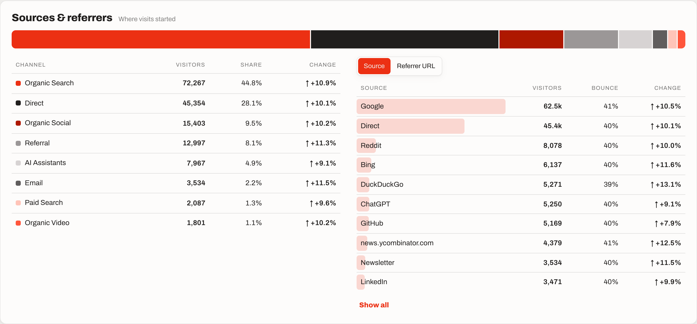
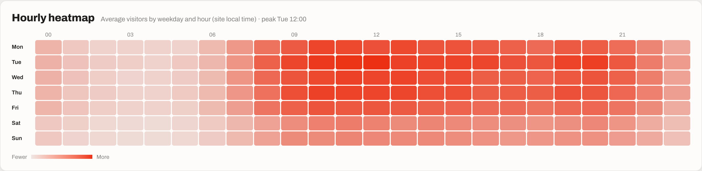
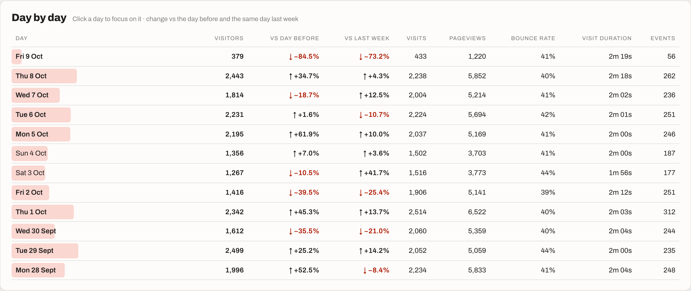
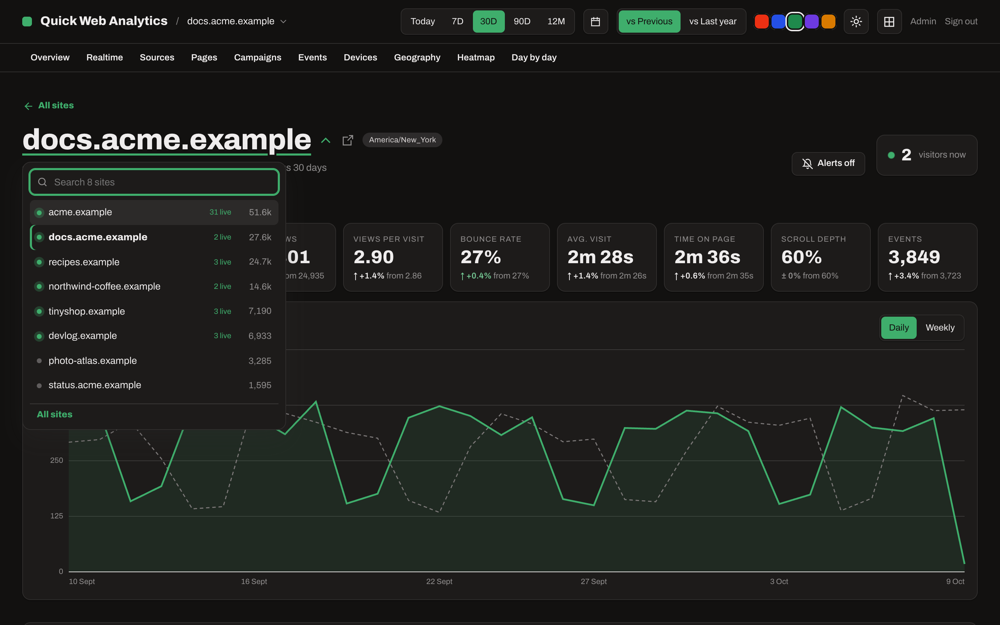

# Quick Web Analytics

**Lightweight, privacy-friendly web analytics that runs entirely on your own Cloudflare account.**

No cookies, no servers to look after, no per-pageview pricing. A 2 KB tracker, a fast dashboard built around day-by-day change, and per-site sharing with the people who need it.



## Features

- **Cookieless and private.**
  - Visitors are counted with a salted hash that rotates daily.
  - No cookies, IP addresses or user agents are stored, and visitors can't be followed from one day to the next.
- **Runs on Cloudflare only:** Workers, Durable Objects, R2, D1 and DuckDB-WASM. It costs nothing on top of the Workers Paid plan at small-to-medium volumes.
- **All your sites at a glance:**
  - totals with change against the previous period or last year
  - live visitors across every site
  - cards, heat tiles or a table, sorted by visitors, growth or decline
- **A detailed page per site:**
  - **Metrics and chart:** nine metrics, each with its change, and a chart with the comparison period overlaid. Click the chart to zoom into a day, week or month.
  - **Breakdowns:** realtime with a live map, sources and channels, pages (entry and exit too), UTM campaigns, custom events, devices and browsers, countries and cities.
  - **Day-by-day views:** a weekday × hour heatmap, and a day-by-day table with day-over-day and week-over-week change.
- **Anomaly alerts:** unusual days (spikes, drops, possible outages) are spotted against the same weekday's usual range, hourly for the day so far and nightly for whole days, and marked with an alarm on the chart. Anyone can opt in to an email per site (Cloudflare Email Sending).
- **Cost brakes:** a daily event limit per site (recording pauses until midnight, admins are emailed), an emergency stop, and guidance for an edge rate limit and billing alerts. Cloudflare has no hard spending cap, so QWA brings its own.
- **Everything filters:** click any row to filter the whole page by it, then flip a filter between *is* and *is not*.
- **Share per site:** admins give each person access to specific sites. Sign-in uses Cloudflare Access (email codes, Google, GitHub…), so QWA never stores passwords.
- **Plausible-compatible:** existing Plausible snippets keep working while you switch over, and history can be imported from a self-hosted Plausible CE instance. See [MIGRATING.md](docs/MIGRATING.md).
- **Looks how you like:** light and dark, five accent colours, rounded cards or a flat grid. It works on phones.

| | |
|---|---|
|  |  |
|  |  |
|  |  |

<sub>Screenshots show the built-in demo with synthetic data (`npm run demo`).</sub>

## Try it locally (no account needed)

```sh
git clone https://github.com/Zesty0wl/quick-web-analytics.git
cd quick-web-analytics
npm install
npm run demo
```

Open <http://localhost:8787>. The demo:
- runs both Workers locally with local storage
- seeds eight fictional sites with about 13 months of realistic traffic
- keeps adding live visitors, so the realtime panels move
- signs you in as an admin

`npm run demo -- --fresh` starts again from scratch.

## Deploy your own

See **[docs/DEPLOY.md](docs/DEPLOY.md)**. In short:
1. Create a D1 database and an R2 bucket.
2. Copy `apps/worker/wrangler.example.jsonc` to `wrangler.jsonc` and set your hostname.
3. Run `npm run deploy`.
4. Put the dashboard behind Cloudflare Access.

Allow about 20 minutes.

Then add the snippet to your site:

```html
<script defer src="https://analytics.example.com/t.js" data-site="example.com"></script>
```

Custom events: `qwa("Signup", { props: { plan: "pro" } })`, or `class="qwa-event-name=Signup"` on any element. Tracker options are listed in the [deployment guide](docs/DEPLOY.md#tracker-options).

## How it works

```
 tracker (/t.js) ──POST /e──▶ Worker "qwa" ──▶ SiteDO (Durable Object per site: sessions, today, realtime)
                                  │                    │ every 5 min
                                  │                    ▼
                                  │              R2: Parquet files per site / table / day → month
                                  │                    ▲
 dashboard (Access) ──/api/*──▶   ├──▶ Worker "qwa-query" (DuckDB-WASM reads the Parquet it needs)
                                  └──▶ D1: sites, users, access grants, daily totals
```

The details, and the reasons behind them, are in [docs/ARCHITECTURE.md](docs/ARCHITECTURE.md).

| Path | What's there |
|---|---|
| `apps/worker` | Main Worker: ingestion, auth, dashboard API, `SiteDO`, scheduled jobs, demo mode |
| `apps/query` | Query Worker: turns a small query spec into DuckDB SQL over R2 |
| `apps/web` | Dashboard (React, TanStack Query, hand-rolled SVG charts, d3-geo map) |
| `packages/tracker` | The tracker served at `/t.js` |
| `packages/shared` | Storage layout and query spec used by all of the above |
| `packages/tracker-compat` | Plausible's MIT tracker builds, for Plausible-compatible ingestion |
| `tools/import-ce` | Import history from a self-hosted Plausible CE instance |

## Develop

```sh
npm run demo          # the easiest way to work on the dashboard
npm test              # worker, query and tracker tests
npm run typecheck
npm run build         # dashboard + tracker → apps/worker/public
```

See [CONTRIBUTING.md](CONTRIBUTING.md).

## Status

QWA is young, but it runs in production for a couple of dozen sites. Planned:
- API tokens and an MCP server, so agents can query stats
- public share links
- email digests

Issues and pull requests are welcome. See [CHANGELOG.md](CHANGELOG.md) for what's changed.

## Licence

MIT, see [LICENSE](LICENSE). Bundled third-party components are listed in [THIRD_PARTY_NOTICES.md](THIRD_PARTY_NOTICES.md).

QWA contains no code from Plausible's server or dashboard (AGPL-3.0). Only Plausible's MIT-licensed tracker is bundled, for migration. "Plausible" is a trademark of Plausible Insights OÜ; this project isn't affiliated with or endorsed by it.
